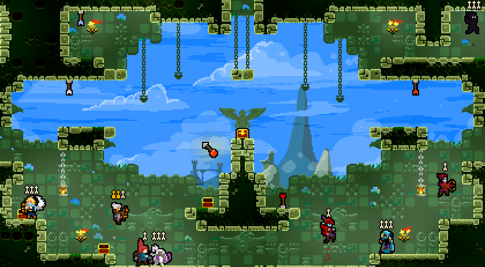
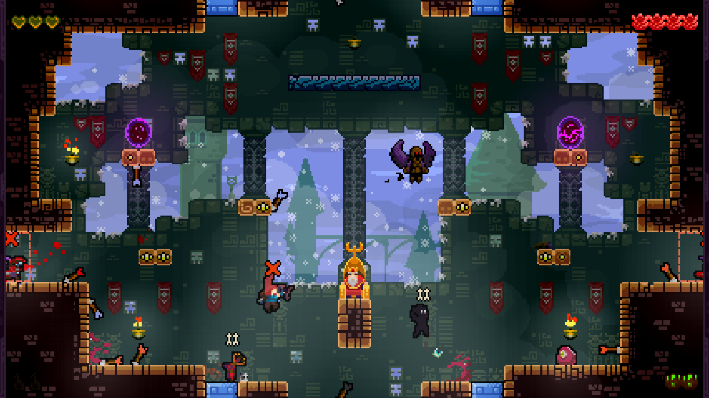
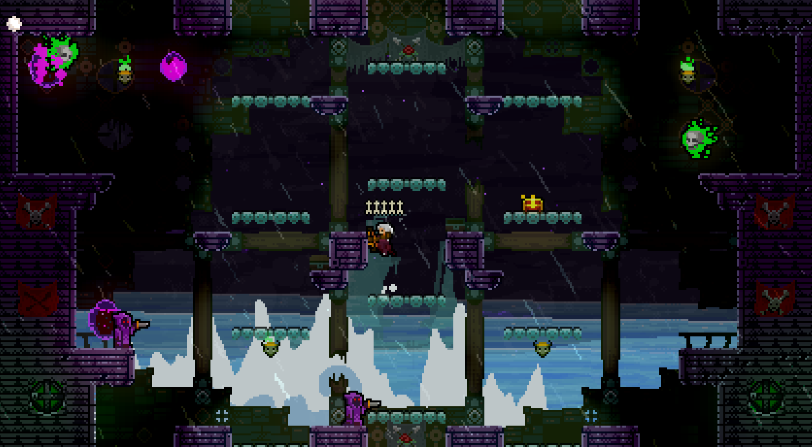

# Wider Set

Wider Set is an Eight Player Mod ported as a FortRise mods. This includes a wider levels for Versus, 4-Players Quest mode, and 8-Players Dark World mode (WIP). 

## Versus

## Quest

+ The quest saves are separated from original, so you have to unlock all of the quest level again but in Wide levels. (or use cheats to unlock all levels).

## DarkWorld

### Installation
**Prerequisites:**
+ TowerFall (v1.3.3.1 or higher)
+ [FortRise](https://github.com/Terria-K/FortRise) (v4.4.2.0 or higher)

**Instructions**
+ Download the `.zip` file from the Releases page.
+ Extract the `.zip` file.
+ Put the folder in your `Mods` from your TowerFall.
+ Enjoy!

This mod brings a way to play both Standard and Wider set. So you don't have to remove this mod when you want to play the original set.

### This project is still on ALPHA, please report bugs if you find one.

## Credits:
+ **[RedDude](https://github.com/RedDude)** - for providing the Versus Levels and Standard and Wider set assets. As well as a guide for changing the screen size and extending the players count.
